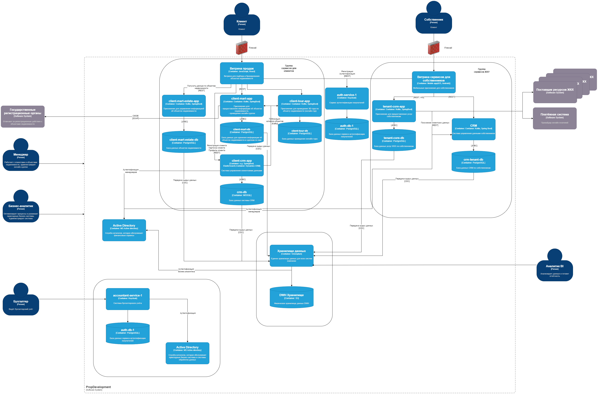

# Описание проектной работы

## Разделы

- [Замечания к архитектуре и диаграмме](#замечания-к-архитектуре-и-диаграмме)
- [Оглавление](#оглавление)

## Замечания к архитектуре и диаграмме

Изначальная диаграмма:

Перед выполнением заданий
необходимо указать несколько замечаний к этой диаграмме и представленной на
ней архитектуре компании PropDevelopment:

1. Обычно firewall устанавливают не между пользователем и приложением, а между
приложением и внутренней инфраструктурой. При этом приложение работает в DMZ и
сквохь firewall общается с внутренней инфраструктурой. На примере приведенной
диаграммы Собственник общается с Android приложением сквозь firewall. Это сложно
себе представить, так как Andriod приложение должно находиться на мобильном
устройстве пользователя и при этом для доступа к приложению необходимо каким-то
образом преодолевать firewall, который по своей натуре занимается фильтрацией
сетевого трафика.
2. База данных PostgreSQL поддерживает плдключение с использованием SSL. На
диаграмме везде указан протокол JDBC, что само по себе ожидаемо для Java
приложений. Если в этих соединениях не включен SSL, то это не сложно исправить.
В духе этого спринта будем полагать, что SSL не включен и примем диаграмму за
"чистую монету".
3. GreenPlum основан на PostgreSQL в большей своей части кода, поэтому всё, что
относится к нашему спринту, относящееся к PostgreSQL точно так же относится и к
GreenPlum.
4. Аналогично PostgreSQL, MS SQL тоже поддерживает SSL для подключений. Так же
как и для PostgreSQL будем считать, что эту настройку надо включить.
5. Менеджер и аналитик имеют стрелки доходящие до границы PropDevelopment и не
ясно куда дальше они имеют доступ. Будем считать, что они имеют доступ ко всем
элементам инфраструктуры компании. При этом не указан тип подключения. Поэтому
для них, Аналитика BI и Бухгалтеров будем считать, что они не используют VPN
(хотя это сложно себе представить в наше время), на их пути нет никаких firewall
и подключаются напрямую к серверам для своей работы. Хотя вполне разумно для
удаленных пользователей использовать jump server внутри компании для доступа к
большому количеству внутренних серверов или что-то вреде VDI.
6. Будем считать, что диаграмма показывает PROD среду, а DEV и TEST созданы по
полной аналогии с ней. Иначе все упащения в DEV и TEST потребуют собственного
анализа. В задании сказано *"Для временного расширения мощностей на этапах
доработки и тестирования команды могут использовать облачные ресурсы и
управляемые сервисы."* Это можно понять двояко. В худшем варианте это означает,
что DEV и TEST живут на своей инфраструктуре и отличаются по настройкам от PROD.
7. На диаграмме не указаны связи по которым партнеры из управляющих компаний
имеют доступ к внутренним ресурсам PropDevelopment и *"могут изменять данные
клиентов и комплексов других компаний".* Если это так, то это означает
недостатки в APIб которым пользуются эти компании и предоставляется
PropDevelopment.
8. На диаграмме скорее всего опечатка так как там представлены две БД с именем
auth-db-1. Для раличия этих БД бедем называть их по именам соответствуюзих
сервисов: auth-srvice-db и accountant-service-db.
9. На диаграмме представлены два Active Directory с одинаковыми именами. Будем
считать, что это две разных инсталляции сервиса и никак друг с другом не связаны.
10. Каким-то образом бухгалтерия занимается своими делами и при этом их система
никак не связана ни с одной из других внутренних или внешних систем. При этом
БД auth-db-1 от accountant-service-1 занимается только аутентификацией
покупателей и ничего "бухгалтерского" в ней нет. Можно предположить, что
информация о финансовой деятельности компании хранится в виде каких-то файлов
на S3 DWH, но у бухгалтеров нет к ней доступа.

## Оглавление

- [-> Разработка проверочного листа по безопасности данных](./Task1/ReadMe.md)
- [-> Разработка и заполнение проверочного листа для бизнес-систем](./Task2/ReadMe.md).
- [-> Внешние интеграции](./Task3/ReadMe.md).
- [-> Защита доступа к кластеру Kubernetes](./Task4/ReadMe.md).
- [-> Управление трафиком внутри кластера Kubertnetes](./Task5/ReadMe.md).
