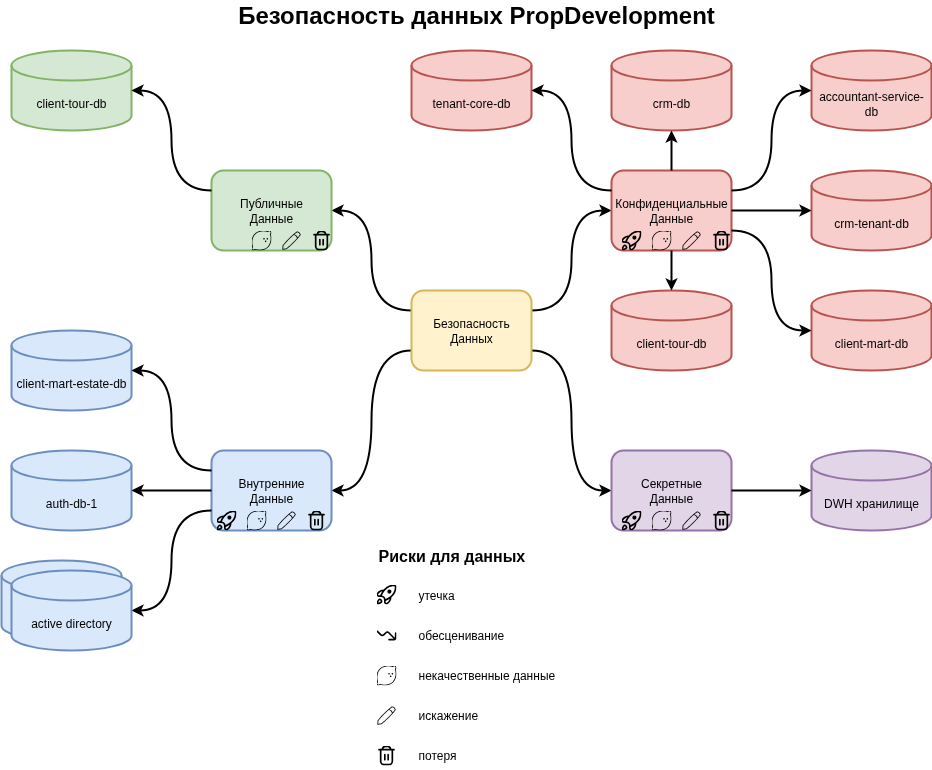

# Разработка проверочного листа по безопасности данных

## Разделы

- [Диаграмма безопасности данных PropDevelopment](#диаграмма-безопасности-данных-propdevelopment)
- [Группы безопасности данных](#группы-безопасности-данных)
- [Риски для данных](#риски-для-данных)
- [Оценка рисков для данных](#оценка-рисков-для-данных)

## Диаграмма безопасности данных PropDevelopment

.

## Группы безопасности данных

Задание предлагает разбить все данные на 4 группы:

1. Публичные;
2. Внутренние;
3. Конфиденциальные;
4. Сектретные.

Каждая из БД в системах компании относится к одной из этих групп. Для
наглядности каждая группа имеет свой цвет БД. У каждой группы иконками показаны
риски для данных в этой группе.

Так как данные о платежах относятся к "Сектретным", то DWH, где как я понимаю
хранится информация о них, строго относится к этой группе. Так как к этому S3
сервису имеют доступ практически все системы компании, то и делать на нем надо
как минимум по одному bucket на каждый из таких сервисов, чтобы предотвратить
какю-либо утечку данных. Данные о платежах лучше хранить за пределами компании с
возможностью загрузки отчетов. Например, выгружать отчеты о платежах из
банковского приложения и не хранить во внутренних системах никаких данных,
противоречащих требованиям PCI DSS.

## Риски для данных

Я решил не присвивать риск "обесценивыание" ни одной из групп, так как считаю,
что на всем этапе жизни данных они имею ценность. Единственное исключение из
этого правила - данные, осевшие в кэшах пользовательских приложений и с тех пор
изменившиеся во внутренних БД. Например, публичные данные о доступных квартирах,
которые уже проданы.

Группа "публичных данных" не имеет иконки риска утечки по понятным причинам. Все
остальные группы данных имеют этот риск так как могут стать как минимум вектором
атак если используются в открытом виде как внутри так и снаружи компании.

Риски некачественных, искаженных и потери данных присущи всем группам, так как
это влияет на процессы компании. Например, неточные или утраченные данные о
продажах квартир влияют на отчетность компании. Эти отчеты могут быть как
публичными (репутационный риск), так и внутренними (например, связанные с этим
процессы планирования и т.п.).

## Оценка рисков для данных

Критичность риска для данных напрямую зависит от группы данных и типа самих
данных. Тут нет однозначного ответа для прямой связи типа риска и его
критичности. В общем, можно сказать, что "утечка" данных скорее будет
"критической", а "обесценивание" скорее всего будет "незначительной". Все
остальные риски будут сильно зависить от типа и группы данных и иметь значения
всего диапазона категорий.

Задание предлагает рассмотреть следующие риски для данных:

- Утечка - "критический". Самая высокая по важности группа риска. Это как
минимум репутационный риск для компании. Так же утечка конфиденциальных данных
может повлечь и юридические проблемы.
- Некачественные данные - все 3 категории. Некачественные данные могут
просочиться в отчеты и на наснове этих отчетов могут быть приняты неверные
решения. В этом случае категория - "критическая". Опечатка в номере телефона
клиента для записи на тур квартивы будет иметь "незначительную" категорию.
- Искажение - все 3 категории. В зависимости от места и типа данных тут могут
быть разные по важности риски. Например, искажение в ФИО покупателя не несет
особых рисков для компании. А вот искажение стоимости квартиры типа пропущенного
нуля в цене может иметь "свои последствия".
- Потеря - все 3 категории. В зависимости от места этих данных и величина риска.
Наример, утрата информации в ActiveDirectory о доступе сотрудника к системе не
имеет такого же уровня "неприятностей" как утеря информации о доступных на рынке
к продаже квартир.
- Обесценивание - "незначительный". Это довольно низкая группа риска.
Использование устаревших в плане актуальности данных (не путать с
некачественными данными) не несет особого ущерба как для компании, так и для ее
клиентов. Например, клиент хочет заказать посещение квартиры, но она уже
продана. Это просто неудобства клиента.

[<- На главную страницу](../ReadMe.md)
