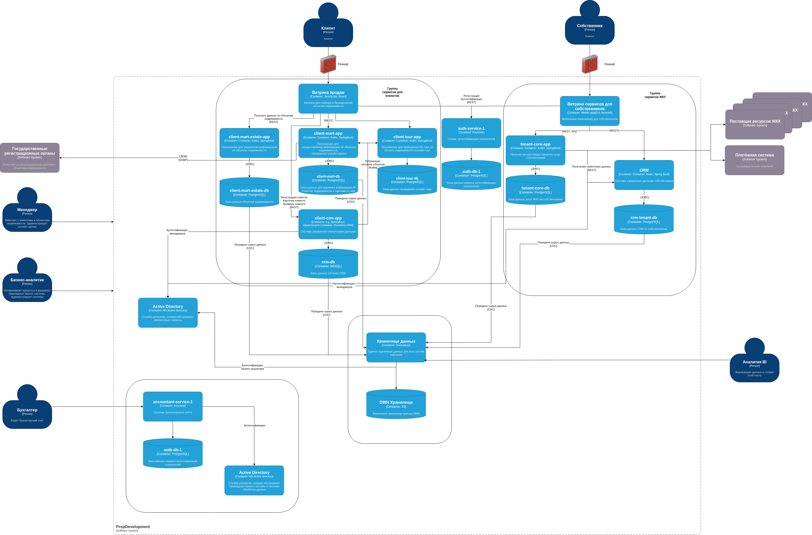

# Разработка и заполнение проверочного листа для бизнес-систем

## Разделы

- [Диаграмма](#диаграмма)
- [Анализ существующей системы](#анализ-существующей-системы)
- [роблемы компании](#проблемы-компании)
- [Проверочный лист для бизнес систем](#проверочный-лист-для-бизнес-систем)

## Диаграмма

.

## Анализ существующей системы

1. Подключения менеджера, бизнес-аналитика, бухгалтера и аналитика BI не
используют никаких мер защиты информации и при этом являются удаленными по
отношению к периметру PropDevelopment. Это крайне опасно в современном мире,
особенно при наличии в системе персональных данных клиентов. Как минимум
необходимо настроить для этой цели VPN. Для менеджера и бизнес аналитика,
которые похоже имеют доступ ко всем системам компании (так как стрелки их
соединений доходят только до периметра компании), можно организовать и jump
server. Вполне возможно рассмотреть и настройку работы всех сотрудников через
VDI, удаленный доступ к которым происходил бы только через VPN с MFA.
2. Из-за наличия в системе DWH персональных данных, система повышается до
самого высого уровня - "секретная". В результате этого все системы, которые
общаются с ней автоматом должны внедрять все необходимые практики для работы с
данными такого уровня. Это потребует внедрения сертификатов для сетевых
соединений, ключей шифрования данных и периодической ротации всего этого
механизма. Роли доступа всем пользователям должны требовать регулярной смены
паролей с необходимым уровнем сложности всех пользователей систем.
3. Все данные на DWH/S3 должны храниться в зашифрованном виде.
4. Подключения к БД client-mart-db, crm-db, crm-tenant-db должны использовать
шифрованные подключения из-за наличия в них персональных данных со своими
сертификатами и механизмом их ротации. Это то, что называется "data in transit".
Данные на дисках этих БД должны храниться в зашифрованном виде. Это "data at
rest". Необходимо убедиться, что бакапы этих БД делаются на физическом уровне
(т.е. просто читаются блоки данных с диска), а не на логическом (т.е.
преобразование зашифрованных данных на дисках в скрипты с CREATE TABLE, INSERT,
COPY командами, где все данные в открытом виде). Если снимать физические бакапы
по каким-то причинам невозможно, но необходимо убедиться в шифровке подключения
к такой БД и шифровке файлов такого бакапа на диске.
5. Из-за наличия персональных данных в PROD системе строжайшим образом запрещен
перенос таких данных в нижние контуры TEST и DEV для каких-либо задач без
предварительной обфускации этих данных.
6. Все подключения с внешними ресурсами (компании ЖКУ, платежные системы,
государственные органы) должны использовать шифрование.
7. Не помешало бы внедрить DMZ для веб серверов обеих витрин.
8. На схеме не представлены мониторинг и аудит сети.
9. Между разными группами систем отсутствуют firewalls.
10. Наличие персональных данных в PROD автоматом запрещает установку сетевых
соединений с ним из контуров TEST и DEV и требует наличие соответствующих
firewalls между этими контурами.

## Проблемы компании

Главные проблемы:

1. Нарушен контроль данных. Есть несколько точек регистрации нового клиента,
координации между этими точками нет. Внутренние потоки данных между
IT-продуктами контролируются не системно. Ограничения по передаваемым данным в
основном обусловлены бизнес-процессами между взаимодействующими IT-продуктами.
Со стороны систем обработки данных нет ограничений на доступ к данным.
2. Есть проблемы с API партнёров. Партнёры — это системы управляющих компаний,
которые позволяют собственникам оплачивать ЖКУ и следить за информацией о доме.
Системы PropDevelopment используют API управляющих компаний без единых политик
по безопасности и без системного контроля за передаваемыми данными. В ходе
интеграций команды разработки не раз замечали, что:
    - Контракты API содержат категории данных, которые явно предоставляют
    персональные данные.
    - Некоторые контракты позволяют внешним пользователям выполнять действия и
    получать данные, к которым у них не должно быть доступа. Например, партнёр
    из одной управляющей компании может увидеть или изменить данные клиентов и
    жилищных комплексов, которые относятся к другой компании.

Предлагаемые решения проблем:

1. Эта проблема решается следующим:
    - централизовать регистрацию клиентов в одном месте и перенаправить все
    системы на использование этого источника;
    - пересмотреть доступ к данным на основании их критичности, а не удобством
    для систем и пользвателей, которые их используют;
    - системы обработки данных так же не должны "случайным" образом иметь
    возможность доступа к данным с большей критичностью без специальных
    механизмов типа врЕменных токенов.
2. Эта проблемы имеет свои решения:
    - необходимо пересмотреть API с клиентами и полностью исключить наличие
    персональных данных в вызовах;
    - внедрить механизмы внути PropDevelopment для исключения утечки и тем более
    манипуляции данными одних компаний другими. Это могут быть как ABAC, так и
    более жесткие требования к вызовам API (например, отсутствие пустых полей,
    которые могут трактоваться как `SELECT * FROM table` без условий
    `WHERE`).

## Проверочный лист для бизнес систем

| №  | Вопрос | Да/нет | Комментарий |
|----|--------|--------|-------------|
| **I. Управление доступом** | | | |
| 1 | Используется ли многофакторная аутентификация (MFA) для доступа к критическим системам и сервисам? | Нет | Удаленный доступ ко всем системам должен использовать MFA |
| 2 | Настроены ли требования к сложности паролей и их регулярное обновление? | | |
| 3 | Проводится ли аудит и пересмотр учётных записей с повышенными привилегиями на регулярной основе? | | |
| 4 | Реализован ли принцип минимальных привилегий при назначении ролей и прав доступа? | | |
| 5 | Автоматически ли удаляются или деактивируются учётные записи после увольнения или изменения должности сотрудников? | | |
| 6 | Ведётся ли журналирование всех операций доступа к системам и данным? Кто имеет доступ к журналам? | Нет | Система мониторинга сетевых событий и аудита не представлены на схеме |
| 7 | Используются ли механизмы контроля доступа на основе атрибутов для повышения гибкости управления доступом? | Нет | Недочеты в API с ЖКУ позволяют доступ к данным другой компании |
| 8 | Используются ли системы аутентификации пользователей для доступа к системам? | | |
| 9 | Созданы ли замкнутые контуры для подсистем, работающих с чувствительными данными? | Не везде | Персональные данные присутствуют во многих системах, которые разделяют контуры с другими системами, у которых меньшая критичность данных |
| 10 | Ограничен ли доступ к системам из внешних источников? | Не везде | Сотрудники имеют прямой удаленный доступ к системам без указания наличия VPN |
| 11 | Ведётся ли единый реестр учётных записей? | Нет | Данные клиентов дублируются в нескольких системах без координации между ними |
| 12 | Используются ли средства управления учётными записями на базе единого реестра? | | |
| 13 | Применяются ли средства для отзыва прав доступа? | | |
| 14 | Используются ли средства централизованного контроля доступа? | Нет | Бухгалтерская система использует свой ActiveDirectory, все остальные системы – свой. Это усложняет единообразность этих систем (например, политики паролей могут быть разными) |
| **II. Безопасность данных** | | | |
| 1 | Разработана ли политика классификации данных, и актуализируется ли она в соответствии с действующим законодательством? | Нет | Все системы имеют доступ "везде" |
| 2 | Используется ли шифрование на уровне базы данных, файловой системы и при передаче данных по сети? | Нет | На диаграмме не указано. Скорее всего, что нет |
| 3 | Реализованы ли механизмы управления ключами шифрования? | Нет | Раз нет шифрования, то нет и ключей |
| 4 | Проводится ли регулярное резервное копирование данных? Хранятся ли резервные копии в защищённых хранилищах? | Нет | Скорее всего S3 не имеет разграничения по bucket по типу данных. Скорее всего и шифрование "data-at-rest" отсутствует |
| 5 | Выполняется ли регулярное тестирование процесса восстановления данных из резервных копий? | | |
| 6 | Ограничен ли доступ к резервным копиям данных, и зашифрованы ли они? | Нет | Скорее всего что нет |
| 7 | Ведётся ли учёт персональных данных, и применяются ли специальные процедуры обработки и хранения для различных типов данных (общедоступные, конфиденциальные, критически важные)? | Нет | Иначе не было бы возможности манипуляции "чужими" данными и утечки в личных кабинетах пользователей |
| 8 | Осуществляется ли мониторинг доступа к данным на основе их классификации, и используются ли метки безопасности для маркировки данных? | Нет | Все системы имеют доступ "везде" |
| 9 | Разработаны ли процессы и системы Data Governance для управления данными? | Нет | |
| 10 | Реализованы ли системы или процессы безопасного уничтожения данных? | Нет | Отсутствие Data Governance |
| 11 | Используются ли системы или процессы контроля целостности данных? | | |
| 12 | Реализованы ли системы или процессы контроля сохранности данных? | | |
| 13 | Применяются ли средства или процессы анонимизации данных? | | |
| 14 | Разработана ли инструкция по процессу восстановления данных? | | |
| **III. Защита инфраструктуры** | | | |
| 1 | Используется ли межсетевой экран для ограничения входящего и исходящего трафика? | Нет | Компании ЖКУ подключаются без firewall |
| 2 | Реализована ли сегментация сети на логические зоны (DMZ, корпоративная сеть, гостевая сеть) для ограничения доступа к критическим ресурсам? | Нет | |
| 3 | Используются ли IDS/IPS-системы для обнаружения и предотвращения сетевых атак? | Нет | |
| 4 | Настроен ли мониторинг сетевого трафика на предмет аномалий и возможных атак, например, DDoS? | Нет | |
| 5 | Проводится ли регулярное сканирование уязвимостей операционных систем, приложений и сетевых устройств? | Нет | |
| 6 | Установлены ли на серверах и рабочих станциях антивирусные программы и системы EDR (Endpoint Detection and Response)? | | |
| 7 | Отключены ли неиспользуемые службы и порты на серверах, рабочих станциях и сетевом оборудовании? | | |
| 8 | Используются ли механизмы контроля целостности системных файлов, и ведётся ли журналирование доступа к системным ресурсам? | | |
| 9 | Проводятся ли автоматизированные сканирования облачных инфраструктур на соответствие рекомендациям безопасности? | Вряд ли | Скорее всего в наличии только проверки, проводимые самим провайдером облачных ресурсов. |
| 10 | Реализовано ли автоматическое обновление сигнатур защиты от вредоносных программ? | | |
| 11 | Осуществляется ли фильтрация трафика между сетевыми сегментами? | Нет | |
| 12 | Используются ли средства для контроля периметра доступа? | Нет | Удаленные работники имеют прямой доступ к внутренним системам без указания какого-либо VPN |
| **IV. Управление инцидентами** | | | |
| 1 | Используется ли система мониторинга безопасности (SIEM) для корреляции событий и анализа аномалий в режиме реального времени? | Нет | |
| 2 | Настроены ли автоматические оповещения об инцидентах и подозрительной активности (например, попытках несанкционированного доступа)? | | |
| 3 | Разработан ли план реагирования на инциденты, включающий анализ, эскалацию и восстановление системы? Проводится ли обучение сотрудников по его использованию? | | |
| 4 | Проводятся ли симуляции инцидентов (учения) для проверки готовности сотрудников к реагированию на кибератаки? | | |
| 5 | Ведется ли статистика по всем зарегистрированным инцидентам и используются ли результаты анализа для корректировки политики безопасности? | | |
| 6 | Как часто проводятся внутренние и внешние аудиты безопасности, и обновляются ли политики и процедуры на основе результатов этих аудитов? | | |
| **V. Специфические аспекты** | | | |
| **1. Общие вопросы** | | | |
| 1 | Используется ли система управления мобильными устройствами (MDM) для контроля доступа к корпоративным данным и приложениям на мобильных устройствах? | | |
| 2 | Настроены ли VPN и шифрование для безопасного удалённого доступа к корпоративным ресурсам? | Нет | |
| 3 | Проводится ли автоматическое выявление и ограничение использования незарегистрированных или неавторизованных устройств в корпоративной сети? | | |
| 4 | Настроены ли политики автоматического резервного копирования в облачной среде, и контролируется ли доступ к этим копиям? | Возможно | |
| **2. Управление оборудованием и физической безопасностью** | | | |
| 1 | Используются ли системы контроля доступа — биометрия, СКУД — в серверных помещениях? | | |
| 2 | Ведётся ли инвентаризация всего оборудования и контроль его состояния с использованием систем управления активами? | | |
| 3 | Используются ли безопасные методы удаления данных перед утилизацией оборудования или передачей его в другие подразделения? | | |

[<- На главную страницу](../ReadMe.md)
