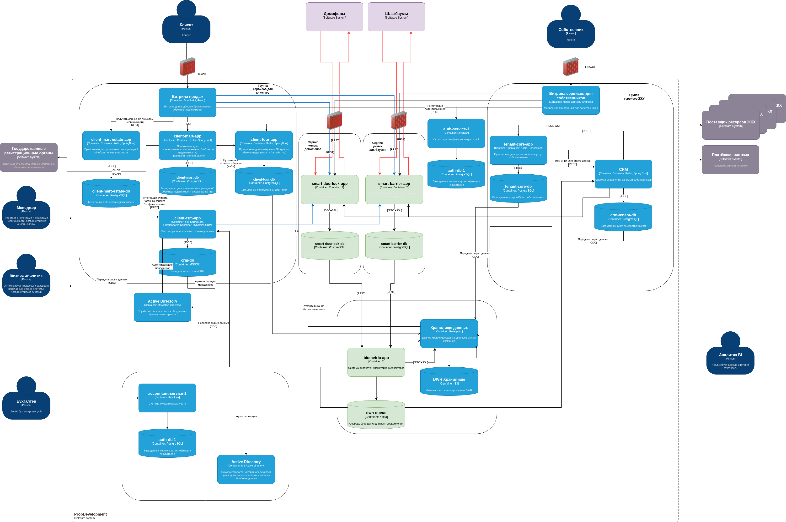

# Внешние интеграции

## Разделы

- [Диаграмма новых бизнес-функций](#диаграмма-новых-бизнес-функций)
- [Введение](#введение)
- [Требования к безопасности данных](#требования-к-безопасности-данных)
- [Протоколы аутентификации и авторизации](#протоколы-аутентификации-и-авторизации)
- [Взаимодействие между системами предприятия и внешней платформой](#взаимодействие-между-системами-предприятия-и-внешней-платформой)

## Диаграмма новых бизнес-функций

.

## Введение

Сразу скажу, что деталей реализации этих умных домофонов и шлагбаумов я не знаю.
Поэтому придется делать предположения. Можно себе представить довольно простой
механизм распознавания номеров автомобилей, который вполне может создать
PropDevelopment. А вот распознавание биометрии домофонами скорее всего будет
требовать какого-то приложения от производителя этих домофонов и совем не ясно
где будет храниться биометрия и как пересылаться от камеры на домофоне у двери
до сервера, где будет храниться эта биометрия, где этот сервер будет находиться
(у компании-оператора или у PropDevelopment) и как эта биометрия будет
передаваться по сетям связи.

Предположим, что все решение чем-то подобно двум широко распространенным:

- открытие телефона с помошью камеры (в этом решении достаточно одной фотографии
владельца);
- "оплата улыбкой" от Сбера (в этом решении снимается довольно серьезный
объем биометрии лица в отделении банка - несколько вариантов с разных углов).
Примерно система работает следующим образом. Терминал на кассе в магазине
использует камеру для снимка лица покупателя, отправляет снимок в Сбер, там по
лицу находят счет в банке, прикреплённый к этой биометрии и при наличии на нем
достаточного количества средств отправляют подтверждение оплаты на кассовый
аппарат. Я не знаю деталей этой реализации о том как происходит подключение
камеры у системе в банке и отправка подтверждения оплаты (просто ли камера грубо
говоря подключена через интернет к банку или в магазине стоит сервер с программой
от Сбера и уже он общается с системой Сбера и т.д.).

Я где-то слышал, что современным системам распознования биометрии достаточно
одного 128-кллрдинатного вектора для точного определения человека по биометрии.
Оставим за рамками дискуссии как различать при этом близнецов. Таким образом нет
смысла пересылать фото или видео информацию по каналам связи, а достаточно
собрать этот массив чисел, зашифровать его и отправить в систему. Так же на
стороне такой системы нет необходимости хранить множество фотографий человека (с
бородой или без, короткой стрижкой и т.п.), а достаточно хранить несколько сотен
байт. Это резко понижает затраты на поддержание такой системы у компаний типа
Сбера с десятками миллионов клиентов и упрощает их защиту. Например, вместе с
периодической сменой ключей шифрования можно время от времени менять "версию"
данных и просто менять последовательность этих векторов в общем списке таким
образом не теряя самих данных периодически делать их непригодными для старых
алгоритмов дешифровки (например, менять местами высоту лица и расстояние между
глаз).

Итак, наши шлагбаумы будут фотографировать фронтальную часть автомобиля и
отправлять эти снимки в PropDevelopment. PropDevelopment будет обрабатывать эти
снимки и отправлять на шлагбаум сигнал открытия, если все в порядке. Параллельно
с сигналом будет оправляться push-уведомление на смартфон владельца парковочного
места чтобы он мог открыть шлагбаум другу и дать ему возможность припарковаться
на месте для гостей. Домофон будет работать по подобному механизму и открывать
дверь хозяину или давать ему возможность впустить гостей.

Я не совсем понимаю зачем во всей этой системе нужна управляющая компания и
какую роль она будет играть. Варианты:

- ходить с гаечными ключами и ремонтировать эти умные устройства (в таком случае
не понятно зачем эти компании подключать к системам PropDevelopment);
- посадит бабульку у каждого домофона (но бабулька и так знает всех жильцов
подъезда и PropDevelopment ей совсем не нужен для того, чтобы помочь домофону
открыть дверь).
Оставим этот момент для доработки задания в этом спринте.

На диаграмме обмен информацией с умными устройствами показан красными стрелками.
Синие стрелки от клиентской части не несут ничего кроме упрощения распутывания
клубка из линий около firewalls перед систмемами умных устройств.

## Требования к безопасности данных

Как мы предположили, умные устройства просто посылают фотографию. Сама по себе
эта информация не является персональной, так как она не позволяет однозначно
соединить персонаж или автомобиль с конкретным человеком. Поэтому кроме
шифрования передаваемой фотографии по общим каналам связи ничего особенного не
надо. Каким-то образом каждый конкретный шлагбаум должен быть подключен каналом
связи скажем к роутеру в доме, а уже этот роутер через обычный интернет к
системам PropDevelopment. Роутеры умеют устанавливать VPN соединения и этого
должно быть достаточно для наших задач.

Внутри компании каждый тип устройств будет иметь свой контур и защищен своим
firewall. Это позволит минимизировать урон от взлома одной системы и не
распространить угрозу на другой тип устройств.

Для регистрации биометрии и номеров автомобилей будут использоваться
существующие мобильные приложения PropDevelopment. Эти приложения отправят
биометрику или номер автомобиля на обработку в smart-doorlock-app (для
превращения фотографии в тот 128-координатный вектор) или в smart-barrier-app
для регистрации автомобильного номера.

На основании полученных фотографий с домофонов или шлагбаумов будет проводиться
генерация тех векторов со 128-координатами для лица или одной строки текста для
номера автомобиля. Эти корокие объекты будут отправляться в систему
biometric-app в контуре "DWH / Хранилища данных". Эта система будет проверять
наличие подобного вектора или номера автомобобиля среди клиентов компании. Если
есть совпадение, то biometric-app будет делать следующее:

- отправлять положительный ответ в систему smart-doorlock-app или
smart-barrier-app;
- выставлять в очередь dwh-queue сообщение об отправке push-уведомления
клиенту или собственнику (а приложения client-crm-app или crm будут их забирать
и отправлять своим клиентам в приложения).
В случае негативного результата обработки биометрии biometric-app будет
отправлять отрицательный ответ в приложения умных устройств на их REST запрос.
Ни на каком этапе внутри систем умных устройств не будет происходить совмещение
данных биометрии и конкретного клиента PropDevelopment. Максимум при взломе
можно будет установить, что конкретная биометрия принадлежит какому-то из
клиентов PropDevelopment и он соответствует конкретному домофону в конкретного
подъезда и то, если есть возможность проследить откуда пришел запрос через
firewall в обратном направлении.

Для такого разъединения персональных данных и биометрии необходимо внедрить
небольшое приложение и очередь в контуре DWH, где системы поддержки владельцев
и клиентов будут забирать сигналы для push-уведомлений.

Хорошей практикой будет установка firewall между контурами разных систем внутри
PropDevelopment и шифровка подключений к БД (data-in-flight). Хранение в самом
DWH этой биометрии так же должно использовать шифрование "data-at-rest". Так как
всё это будет требовать сертификаты, то необходима установка автоматического
механизма их ротации. Мониторинг аномалий сетевого трафика и алертинг в случае
необходимости так же требует настройки, если этого еще не сделано.

## Протоколы аутентификации и авторизации

В данном решении нет необходимости для дополнительных протоколов аутентификации
и авторизации, так как общение новых систем будет происходить только с "умными
устройствами", подключенными по VPN. Весь остальной функционал станет небольшой
доработкой в уже существующие решения со своими протоколами аутентификации и
авторизации.

## Взаимодействие между системами предприятия и внешней платформой

Это взаимодействие подробно описано во Введении и наборе предположений из-за
нехватки деталей в задании, где вообще ставится вопрос о назначении этих
компаний во всем этом решении кроме поддержки аппаратуры на местах
"ремонтниками".

[<- На главную страницу](../ReadMe.md)
